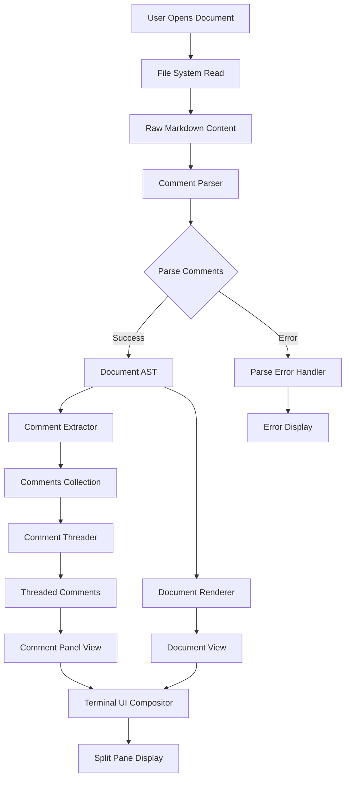
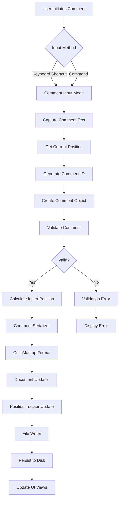
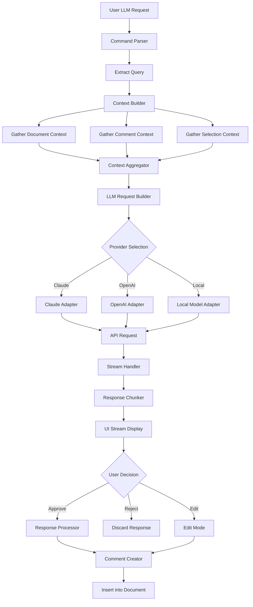
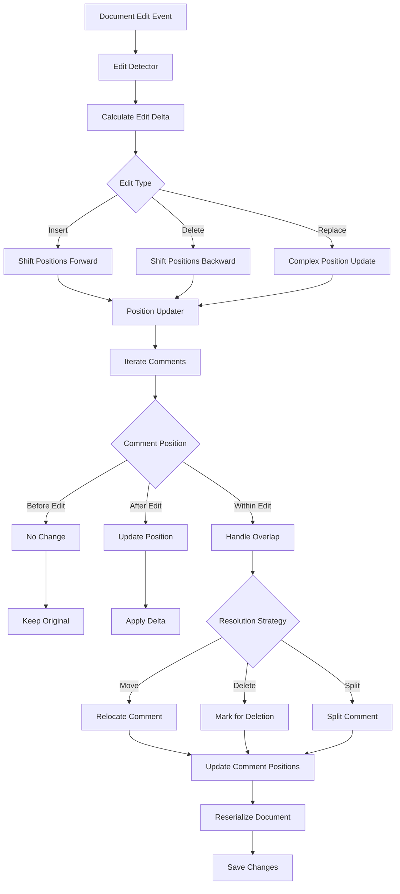
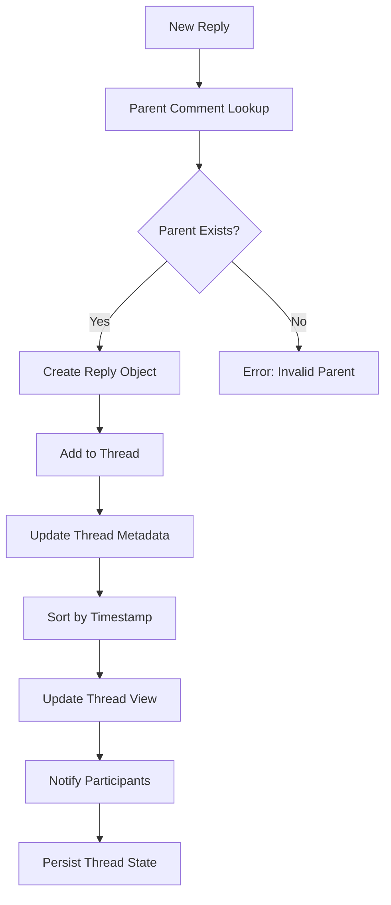
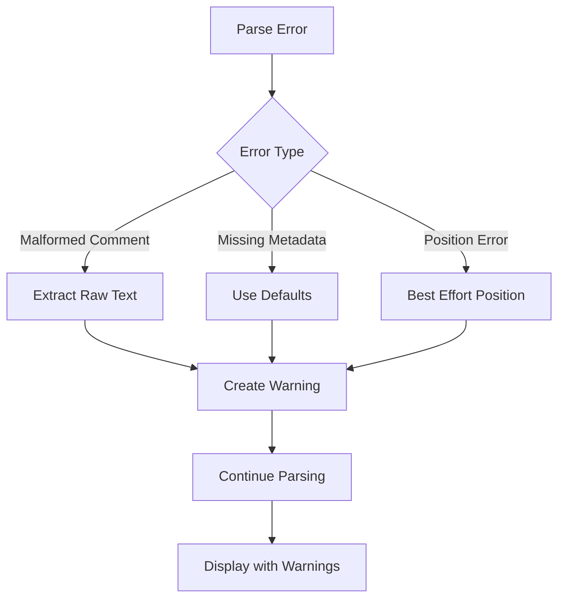
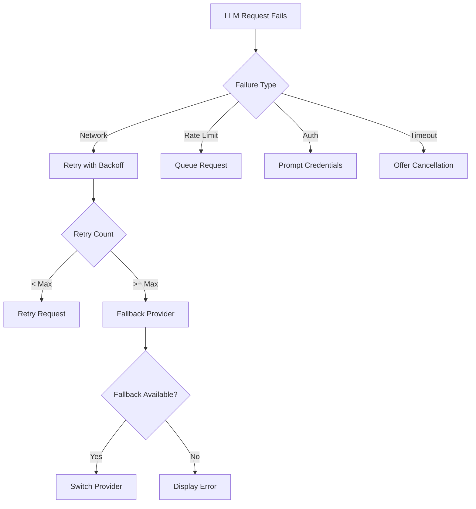
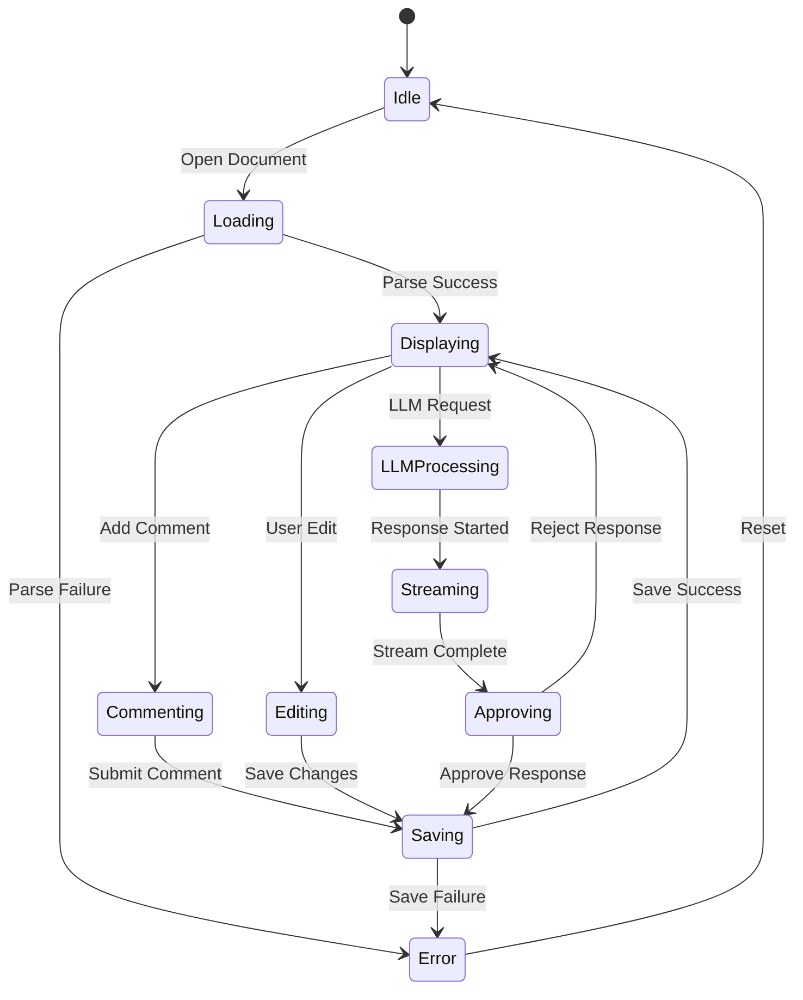

# Data Flow Specification

## System Overview

The commenting system processes markdown documents with inline comments, provides interactive terminal UI, and integrates with LLM providers for AI-assisted writing.

## Core Data Flows

### 1. Document Loading and Display

### 2. Comment Creation Flow

### 3. LLM Integration Flow

### 4. Comment Position Tracking During Edits

### 5. Thread Management Flow

## Error Handling Paths

### Parse Error Recovery

### LLM Failure Handling

## State Synchronization

## Component Responsibilities

### Parser Component
- Tokenize markdown content
- Identify comment markers
- Build document AST
- Extract comment metadata
- Handle malformed syntax gracefully

### Document Manager
- File I/O operations
- Change detection
- Position tracking
- Serialization/deserialization
- Backup management

### UI Controller
- Keyboard event handling
- View composition
- Focus management
- Layout calculations
- Scroll synchronization

### LLM Orchestrator
- Provider selection
- Context preparation
- Request queuing
- Response streaming
- Error recovery

### Position Tracker
- Calculate text offsets
- Map line/column to offset
- Track edit deltas
- Update comment anchors
- Handle position conflicts

## Performance Considerations

### Async Operations
- File I/O: Always async
- LLM requests: Always async with streaming
- Parsing: Async for large files (>1MB)
- UI rendering: Sync with buffering

### Caching Strategy
- Cache parsed AST
- Cache comment threads
- Cache LLM context windows
- Invalidate on document change

### Batch Operations
- Batch position updates
- Batch UI redraws
- Batch file writes (with debouncing)