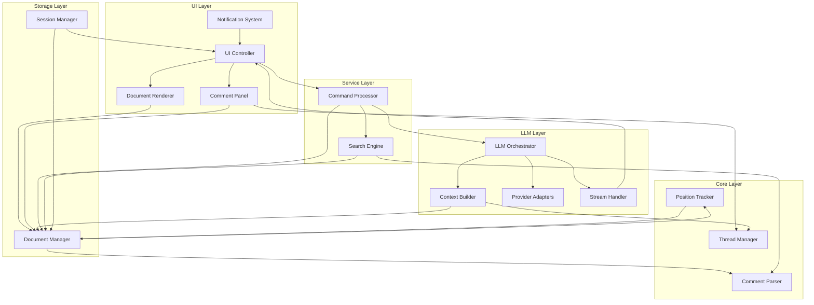

# Dependency Graph and Integration Points

## Component Dependency Graph



## Dependency Layers

### 1. Foundation Layer (No Dependencies)
These components have no dependencies on other system components:

- **Comment Parser**: Pure transformation logic
- **Thread Manager**: Pure organizational logic
- **Document Renderer**: Pure rendering logic
- **Provider Adapters**: Only external API dependencies

### 2. Core Services Layer
Components with minimal dependencies:

- **Position Tracker**
  - Depends on: Document content structure
  - Depended by: Document Manager, UI components

- **Context Builder**
  - Depends on: Document Manager, Thread Manager
  - Depended by: LLM Orchestrator

### 3. Management Layer
Components that coordinate others:

- **Document Manager**
  - Depends on: Comment Parser, Position Tracker
  - Depended by: Most other components
  - Central hub for document operations

- **Session Manager**
  - Depends on: Document Manager, UI Controller
  - Depended by: Application lifecycle

### 4. Orchestration Layer
Components that coordinate complex workflows:

- **LLM Orchestrator**
  - Depends on: Context Builder, Provider Adapters, Stream Handler
  - Depended by: Command Processor, UI Controller

- **UI Controller**
  - Depends on: Document Renderer, Comment Panel, Command Processor
  - Depended by: User interaction layer

### 5. Application Layer
Top-level components:

- **Command Processor**
  - Depends on: All service components
  - Depended by: UI Controller only

## Integration Points

### 1. File System Integration
```yaml
integration_point: FileSystem
consumers:
  - Document Manager (read/write)
  - Session Manager (session persistence)
interface:
  async: true
  operations:
    - read_file
    - write_file
    - watch_file
    - file_stats
error_handling:
  - retry_on_lock
  - backup_on_corruption
  - graceful_degradation
```

### 2. Terminal Integration
```yaml
integration_point: Terminal
consumers:
  - UI Controller (display/input)
  - Notification System (alerts)
interface:
  async: false
  operations:
    - get_dimensions
    - write_output
    - read_input
    - set_cursor
    - clear_screen
error_handling:
  - fallback_to_simple_mode
  - handle_resize_events
```

### 3. Network Integration
```yaml
integration_point: Network
consumers:
  - Provider Adapters (API calls)
interface:
  async: true
  operations:
    - http_request
    - websocket_connect
    - stream_response
error_handling:
  - exponential_backoff
  - circuit_breaker
  - fallback_providers
```

### 4. Parser Integration
```yaml
integration_point: MarkdownParser
consumers:
  - Comment Parser (document parsing)
  - Document Renderer (syntax highlighting)
interface:
  async: false
  operations:
    - tokenize
    - build_ast
    - validate_syntax
error_handling:
  - partial_parse_recovery
  - error_annotations
```

## Data Flow Integration

### 1. Document Load Flow
```
FileSystem → Document Manager → Comment Parser → Position Tracker
                ↓                      ↓              ↓
            Session Manager     Thread Manager    UI Controller
```

### 2. Comment Creation Flow
```
UI Input → Command Processor → Document Manager → Position Tracker
              ↓                      ↓                 ↓
         Comment Parser      Thread Manager    File System
```

### 3. LLM Request Flow
```
User Query → Command Processor → LLM Orchestrator → Context Builder
                                        ↓                ↓
                                Provider Adapters   Document Manager
                                        ↓
                                  Stream Handler → UI Controller
```

### 4. Search Flow
```
Search Query → Search Engine → Document Manager
                    ↓              ↓
             Comment Parser    UI Controller
                              (highlights)
```

## Event Bus Integration

### Event Publishers and Subscribers

```yaml
events:
  DocumentChanged:
    publisher: Document Manager
    subscribers:
      - Position Tracker (update positions)
      - UI Controller (refresh display)
      - Session Manager (mark dirty)
      - Search Engine (invalidate cache)

  CommentAdded:
    publisher: Document Manager
    subscribers:
      - Thread Manager (update threads)
      - Comment Panel (add to display)
      - Notification System (notify mentions)
      - Position Tracker (register position)

  PositionUpdated:
    publisher: Position Tracker
    subscribers:
      - Document Manager (update comment positions)
      - UI Controller (update highlights)
      - Comment Panel (reorder if needed)

  LLMResponseChunk:
    publisher: Stream Handler
    subscribers:
      - UI Controller (display preview)
      - Session Manager (track usage)

  CommandExecuted:
    publisher: Command Processor
    subscribers:
      - Session Manager (command history)
      - UI Controller (status update)

  UIStateChanged:
    publisher: UI Controller
    subscribers:
      - Session Manager (persist state)
      - Document Renderer (adjust viewport)
      - Comment Panel (filter/sort)
```

## Interface Contracts

### 1. Document Interface
```typescript
interface IDocument {
  // Core operations
  load(filepath: string): Promise<Document>
  save(): Promise<void>
  getContent(): string
  getComments(): Comment[]

  // Modification operations
  addComment(comment: Comment): void
  updateComment(id: string, updates: Partial<Comment>): void
  deleteComment(id: string): void

  // Position operations
  updatePositions(edit: EditOperation): PositionUpdate[]
}
```

### 2. LLM Interface
```typescript
interface ILLMProvider {
  // Configuration
  configure(options: ProviderOptions): void
  isAvailable(): Promise<boolean>

  // Request handling
  createRequest(context: LLMContext): Request
  sendRequest(request: Request): Promise<Response>
  streamRequest(request: Request): AsyncIterator<Chunk>

  // Error handling
  handleError(error: ProviderError): ErrorResolution
}
```

### 3. UI Interface
```typescript
interface IUIComponent {
  // Lifecycle
  initialize(config: UIConfig): void
  render(viewport: Viewport): RenderedOutput
  destroy(): void

  // Interaction
  handleInput(event: KeyEvent): Action
  updateState(state: Partial<UIState>): void

  // Display
  refresh(): void
  focus(): void
  blur(): void
}
```

## Coupling Analysis

### Tight Coupling (Should be minimized)
- UI Controller ↔ Document Renderer (view synchronization)
- Document Manager ↔ Position Tracker (edit coordination)
- LLM Orchestrator ↔ Stream Handler (streaming coordination)

### Loose Coupling (Preferred)
- Comment Parser ↔ Other components (interface-based)
- Provider Adapters ↔ LLM Orchestrator (plugin pattern)
- Search Engine ↔ Document Manager (query interface)

### Decoupling Strategies
1. **Event-driven communication** for state changes
2. **Interface abstractions** for provider variations
3. **Message passing** for async operations
4. **Dependency injection** for testing
5. **Plugin architecture** for extensibility

## Integration Testing Matrix

| Component A | Component B | Integration Test Focus |
|------------|-------------|------------------------|
| Document Manager | Comment Parser | Parse accuracy, error handling |
| Document Manager | Position Tracker | Position update correctness |
| UI Controller | Document Renderer | Display synchronization |
| UI Controller | Comment Panel | Split view coordination |
| LLM Orchestrator | Provider Adapters | Provider switching, fallback |
| LLM Orchestrator | Context Builder | Context size, relevance |
| Command Processor | All Components | Command routing, execution |
| Position Tracker | Document Manager | Edit tracking accuracy |
| Thread Manager | Comment Panel | Thread display correctness |
| Search Engine | Document Manager | Search result accuracy |
| Stream Handler | UI Controller | Streaming display smoothness |
| Session Manager | Document Manager | State persistence |

## Performance Considerations

### Critical Paths
1. **Document Load**: Must be < 1s for files up to 1MB
2. **Keystroke Response**: Must be < 50ms
3. **Comment Creation**: Must be < 100ms
4. **Position Update**: Must be < 200ms for 1000 comments
5. **Search Results**: First results < 100ms

### Optimization Points
- Cache parsed AST in Document Manager
- Batch position updates in Position Tracker
- Debounce UI refreshes in UI Controller
- Stream LLM responses incrementally
- Index search content in Search Engine

### Bottleneck Mitigation
- Lazy loading for large documents
- Virtual scrolling for comment lists
- Background processing for position updates
- Request queuing for LLM calls
- Incremental search indexing